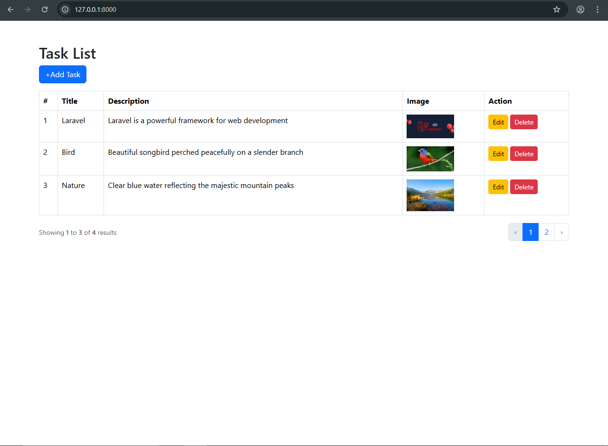
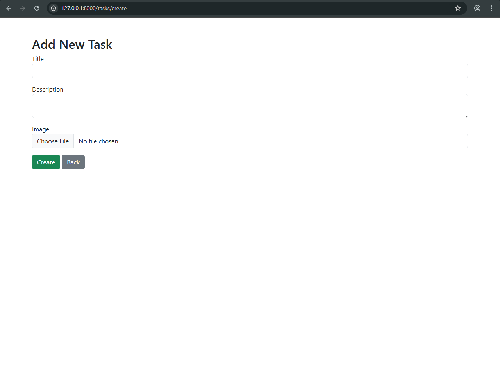
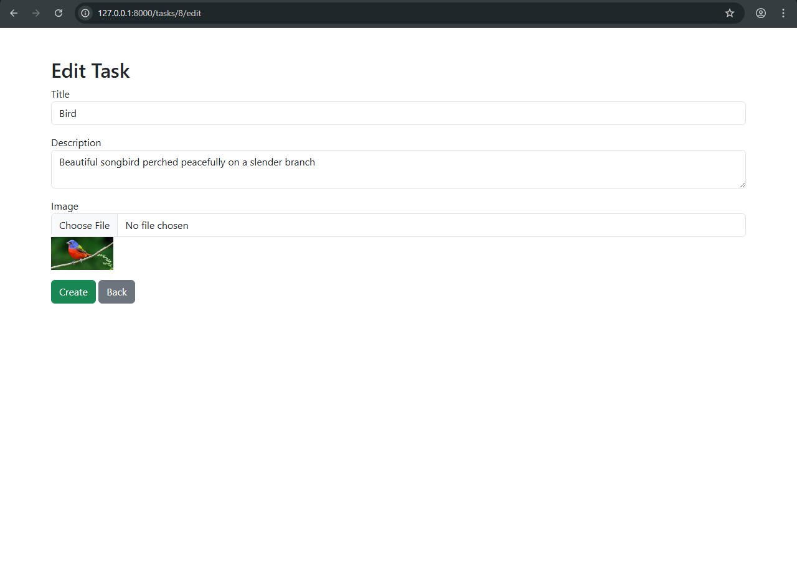

# Laravel CRUD Application

A simple and clean Laravel CRUD application demonstrating core Laravel concepts with MySQL integration.

This project showcases basic Create, Read, Update, and Delete (CRUD) operations using Laravel MVC architecture.

---

# Task Management App Screenshots

Here are some screenshots demonstrating the main functionalities and validation in the app:

## Task List

*Shows the list of all tasks.*

## Create Task

*Form for creating a new task with validation.*

## Edit Task

*Edit an existing task. Validation is applied to ensure correct input.*

 **Note:** All forms have proper validation to prevent invalid data submission.

---

## 🚀 Features
- Create, Read, Update, and Delete (CRUD) operations
- Laravel MVC architecture
- MySQL database integration
- Form validation
- Blade templating engine
- Clean and structured codebase

---

## ⚙️ Tech Stack
- Laravel
- PHP
- MySQL
- Blade Templates
- Bootstrap
- RESTful Routing

---

## 🖼 Screenshots

Screenshots will be added later.

---

## 📦 Installation & Setup

```bash
git clone https://github.com/sohelsamy1/Laravel-Crud.git
cd Laravel-Crud
composer install
cp .env.example .env
php artisan key:generate
php artisan migrate
php artisan serve
```
---

## 👤 Author

**Sohel Samy**   
Laravel | Vue | React Developer   
GitHub: https://github.com/sohelsamy1   
LinkedIn: https://linkedin.com/in/sohelsamy
